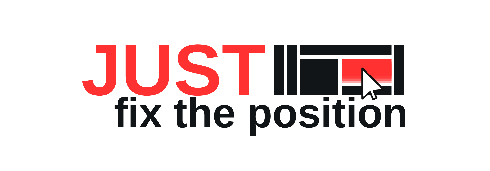

<p align="center">
  
</p>

A small visual tool I use to start interfaces faster.

I built **JUST fix the position** because I kept making interfaces for sites, apps and little software projects, and I wanted a faster way to get the first visual version out of my head and into something an AI could follow.

The idea is simple: place things on a canvas, add a bit of context, then export a JSON file that explains where everything is, what layer it is on, what it means, and what should happen.

I do not really use this as a full design tool for the whole life of a project. My main use is the first pass: the initial visual production. After the first UI version exists, I usually do not come back to this tool much.

For that job, I personally prefer it over Figma. It feels faster and simpler for the way I work.

Fair warning: this was made for me first. I used it while it was broken, kept adding features as I needed them, and did not think too much about the future structure at the time. Some friends used it and liked it, but also found it a little complicated. That is fair. I did not start this thinking it would become public, so sorry for the messy parts.

## What It Does

- Desktop, mobile and custom canvases.
- Drag and drop for images, SVG, GIF, OBJ and fonts.
- Elements with position, size, rotation, opacity, layer order and groups.
- Editable basic components.
- Ready templates: desktop app, landing page, mobile app and dashboard.
- Brush layers that shrink to the actual drawn area.
- Separate brush layers from the brush tool context menu.
- Crop selection with `Ctrl+X` and area copy with `Ctrl+C`.
- Timeline with FPS, frames, duration, keyframes, easing, onion skin and interpolation.
- Inspector fields for semantic role, responsive constraints, states, text, comments and actions.
- JSON export with `llm_brief`, `tracking`, assets, interactions and timeline.

## Why

When you ask an AI to build an interface, it usually has to guess:

- exact element positions;
- real sizes;
- visual hierarchy;
- layer order;
- behavior;
- what is decorative and what is functional.

This project tries to remove that guesswork.

You draw the visual intent, export the contract, and send it to the AI.

## How To Use

Open `index.html` in a browser.

There is no required build step. No install. It is plain HTML, CSS and JS.

Basic flow:

1. Create a desktop, mobile or custom screen.
2. Import assets or use the built-in components/templates.
3. Position everything on the canvas.
4. Fill semantic roles, descriptions, states and actions when needed.
5. Use the timeline if the layout has motion.
6. Export the JSON.
7. Send the prompt + JSON to an AI model.

## Templates

The `Templates` button creates a few simple starter screens.

They are not meant to be perfect production templates. They are just there to give you an idea of how the tool can be used and how a layout can be broken into visual regions.

Available templates:

- `Desktop app`
- `Landing page`
- `Mobile app`
- `Dashboard`

The files live in [templates](templates/). Each template has:

- `layout.json`
- separated PNG screenshots in `assets/`

The PNGs are simple visual references. The important part is that the JSON shows where each region sits on the canvas and what role it should have.

## JSON

The JSON is the main product.

The schema lives at [schema/layout-builder.schema.json](schema/layout-builder.schema.json).

Main structure:

```json
{
  "schema_version": "1.0",
  "app": "just-fix-the-position",
  "llm_brief": {},
  "canvas": {},
  "assets": [],
  "elements": [],
  "interactions": [],
  "components": [],
  "timeline": {},
  "warnings": []
}
```

Each element can carry:

- absolute and percentage coordinates;
- bounds;
- layer order;
- semantic role;
- component name;
- responsive constraints;
- states;
- text;
- crop data;
- brush strokes;
- actions;
- keyframes;
- full tracking metadata.

The AI should treat this as a visual contract, not as loose inspiration.

## Examples For AI

Small examples live in [examples](examples/):

- [examples/simple-layout.json](examples/simple-layout.json)
- [examples/fixtures](examples/fixtures/)
- [examples/prompts](examples/prompts/)

Larger visual examples live in:

- [templates/landing-page/layout.json](templates/landing-page/layout.json)
- [templates/desktop-app/layout.json](templates/desktop-app/layout.json)
- [templates/mobile-app/layout.json](templates/mobile-app/layout.json)
- [templates/dashboard/layout.json](templates/dashboard/layout.json)

## Tests

There is a browser smoke test at:

```bash
node tests/browser-smoke.mjs
```

It checks:

- the basic components list;
- component search;
- templates creating elements and images;
- template images loading;
- zoom;
- cursor behavior by active tool;
- brush layer compaction;
- creating a new brush layer.

The test uses a local Playwright Chromium when available.

## Structure

```txt
index.html
logo.png
ico.png
src/
styles/
schema/
examples/
templates/
tests/
```

## Status

This is not a polished product pretending to be finished.

It is a tool that grew by stacking features whenever I wanted something new. The code reflects that. Some parts are practical, some parts are weird, and some parts probably deserve a proper rewrite later.

But the core idea works: make the first visual version of an interface quickly, export a detailed JSON, and give an AI less room to guess.
