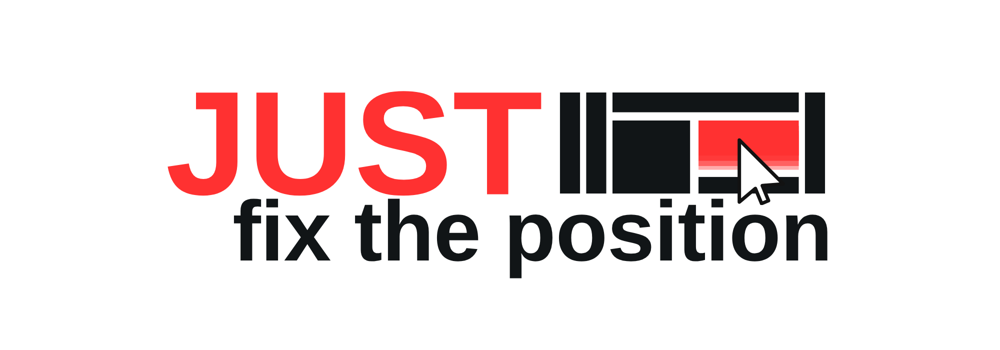

# JUST fix the position



A visual editor for stopping the endless "move it a little to the left", "make it higher", "almost right" loop with AI-generated interfaces.

**JUST fix the position** lets you build a screen on a canvas, place things exactly where you want them, add context to each element, and export a JSON file that explains position, layers, semantic roles, states, interactions and timeline data.

It is not trying to replace Figma.

It is a bridge between a visual layout and code generated by an LLM.

## What It Does

- Desktop, mobile and custom canvases.
- Drag and drop for images, SVG, GIF, OBJ and fonts.
- Elements with position, size, rotation, opacity, layer order and groups.
- Editable basic components.
- Ready templates: desktop app, landing page, mobile app and dashboard.
- Brush layers that shrink to the actual drawn area.
- Separate brush layers from the brush tool context menu.
- Crop selection with `Ctrl+X` and area copy with `Ctrl+C`.
- Timeline with FPS, frames, duration, keyframes, easing, onion skin and interpolation.
- Inspector fields for semantic role, responsive constraints, states, text, comments and actions.
- JSON export with `llm_brief`, `tracking`, assets, interactions and timeline.

## Why

When you ask an AI to build an interface, it usually has to guess:

- exact element positions;
- real sizes;
- visual hierarchy;
- layer order;
- behavior;
- what is decorative and what is functional.

This project tries to remove that guesswork.

You draw the visual intent, export the contract, and send it to the AI.

## How To Use

Open `index.html` in a browser.

There is no required build step. No install. It is plain HTML, CSS and JS.

Basic flow:

1. Create a desktop, mobile or custom screen.
2. Import assets or use the built-in components/templates.
3. Position everything on the canvas.
4. Fill semantic roles, descriptions, states and actions when needed.
5. Use the timeline if the layout has motion.
6. Export the JSON.
7. Send the prompt + JSON to an AI model.

## Templates

The `Templates` button inside the app creates complete screens using local PNG assets.

Available templates:

- `Desktop app`
- `Landing page`
- `Mobile app`
- `Dashboard`

The files live in [templates](templates/). Each template has:

- `layout.json`
- separated PNG screenshots in `assets/`

Those PNGs are not just decoration. They are visual references that help the LLM understand each region of the screen.

## JSON

The JSON is the main product.

The schema lives at [schema/layout-builder.schema.json](schema/layout-builder.schema.json).

Main structure:

```json
{
  "schema_version": "1.0",
  "app": "just-fix-the-position",
  "llm_brief": {},
  "canvas": {},
  "assets": [],
  "elements": [],
  "interactions": [],
  "components": [],
  "timeline": {},
  "warnings": []
}
```

Each element can carry:

- absolute and percentage coordinates;
- bounds;
- layer order;
- semantic role;
- component name;
- responsive constraints;
- states;
- text;
- crop data;
- brush strokes;
- actions;
- keyframes;
- full tracking metadata.

The AI should treat this as a visual contract, not as loose inspiration.

## Examples For AI

Small examples live in [examples](examples/):

- [examples/simple-layout.json](examples/simple-layout.json)
- [examples/fixtures](examples/fixtures/)
- [examples/prompts](examples/prompts/)

Larger visual examples live in:

- [templates/landing-page/layout.json](templates/landing-page/layout.json)
- [templates/desktop-app/layout.json](templates/desktop-app/layout.json)
- [templates/mobile-app/layout.json](templates/mobile-app/layout.json)
- [templates/dashboard/layout.json](templates/dashboard/layout.json)

## GitHub Pages

This repo is ready for GitHub Pages.

There are two good ways to publish it.

### Option 1: GitHub Actions

A workflow is already included at `.github/workflows/pages.yml`.

After pushing the repo:

1. Go to `Settings`.
2. Open `Pages`.
3. Under `Build and deployment`, choose `GitHub Actions`.
4. Push to the `main` branch.

The workflow publishes the static site from the repo root.

### Option 2: Branch Deploy

You can also publish directly from a branch:

1. Go to `Settings`.
2. Open `Pages`.
3. Under `Source`, choose `Deploy from a branch`.
4. Select `main` and `/root`.

Because the project is fully static, both options work.

## Tests

There is a browser smoke test at:

```bash
node tests/browser-smoke.mjs
```

It checks:

- the basic components list;
- component search;
- templates creating elements and images;
- template images loading;
- zoom;
- cursor behavior by active tool;
- brush layer compaction;
- creating a new brush layer.

The test uses a local Playwright Chromium when available.

## Structure

```txt
index.html
logo.png
ico.png
src/
styles/
schema/
examples/
templates/
tests/
```

## Status

This is still evolving, but the core idea is already usable: create a visual layout and export a JSON file detailed enough for an LLM to rebuild the interface with much less guessing.

The next most important work is improving the exported JSON and the public examples.

